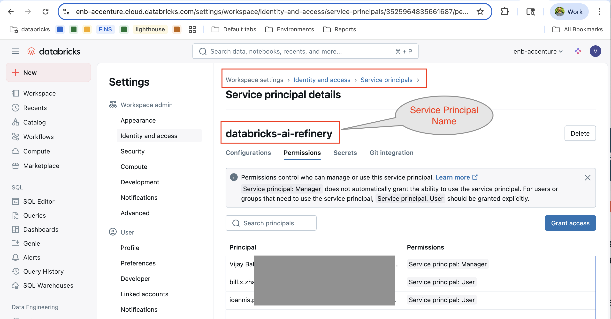
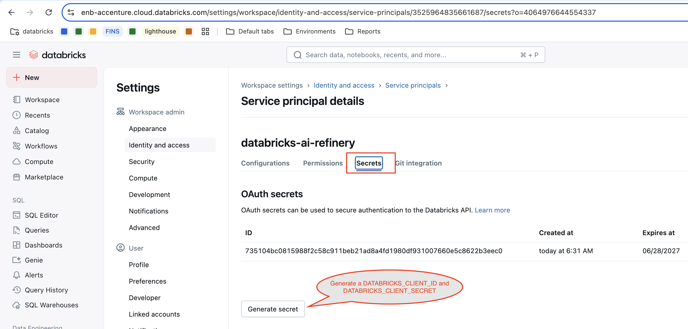
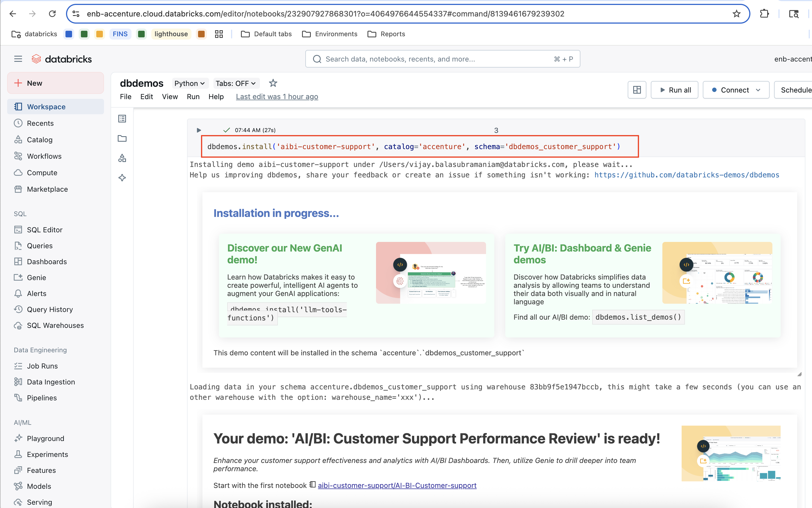
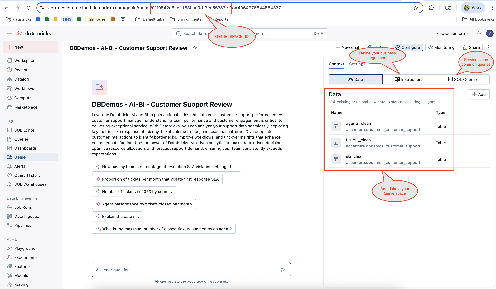
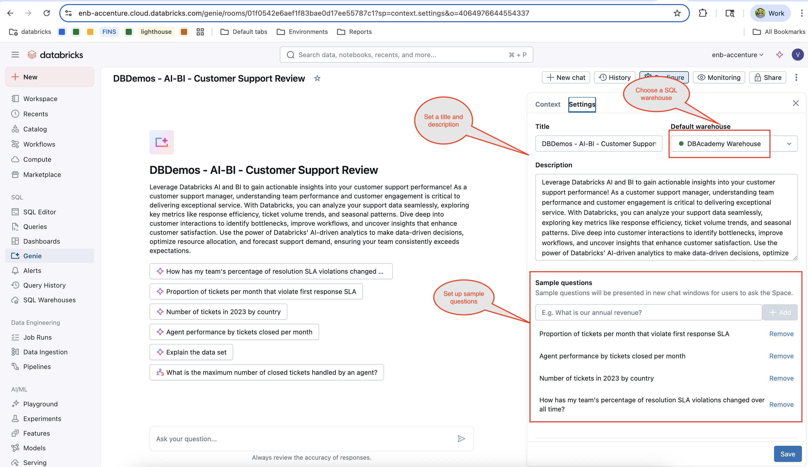
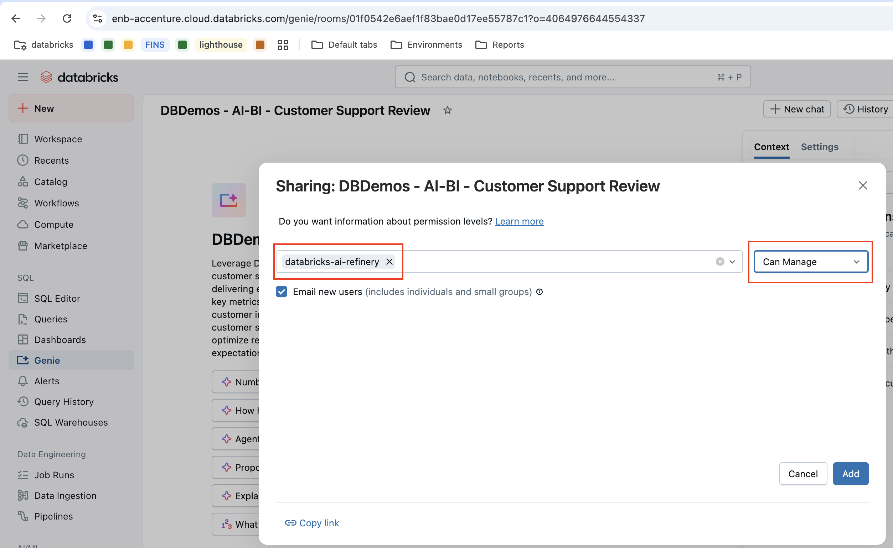
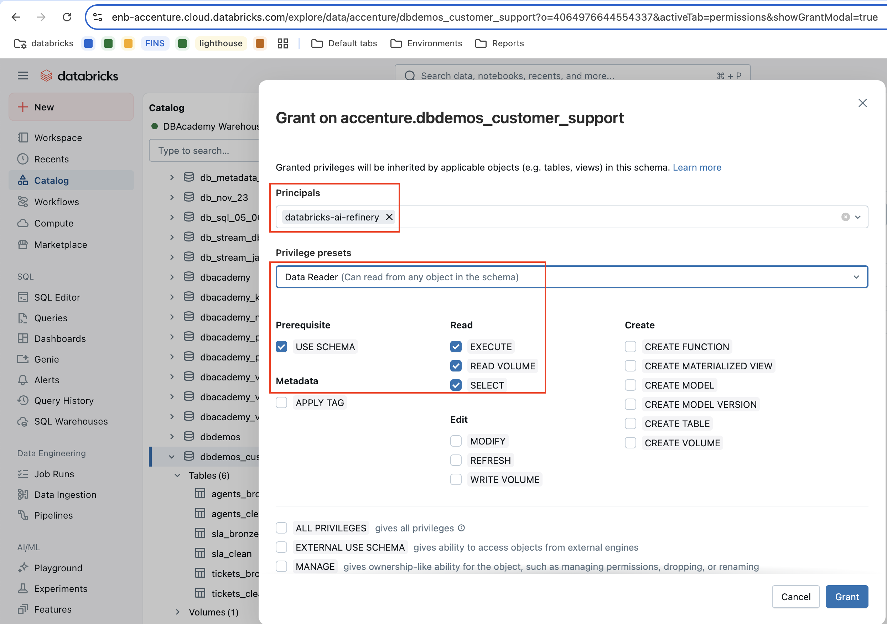

# databricks-ai-refinery

By combining the power of the [Databricks Mosaic AI](https://www.databricks.com/product/artificial-intelligence#related-products) and [Accenture AI Refinery](https://sdk.airefinery.accenture.com/setup/ai_refinery_101/), 
you unlock a wide range of agentic capabilities that supercharge your business applications.

### Key Benefits:

- Leverage **data** stored in the Databricks Lakehouse and Lakebase within your AI Refinery agentic applications
- Leverage AI Refinery **pre-built components** in Mosaic AI agents
- Add **enterprise governance** to AI Refinery applications using Unity Catalog for managing data and agentic tools
- Use Databricks Apps to build **front-ends** for AI Refinery agents rapidly in a governed way
- Interact with AI Refinery agents using **Genie**
- Use Databricks **Vector Search** in AI Refinery agents
- Access AI Refinery agents through the Mosaic AI **Playground**
- Use Databricks managed and custom **MCP servers** in AI Refinery agents 
- Use **AI Bricks** to orchestrate AI Refinery agents using the multi-agent orchestrator
- Implement real-time ingestion using Zerobus from **physical devices** such as cameras and sensors
- Build Brickbuilder **industry solutions** using AI Refinery components


### Authentication

Here is how you can authenticate to Databricks using a [service principal](https://docs.databricks.com/aws/en/dev-tools/auth/oauth-m2m?language=Python) (M2M). Note that it is also possible to set up User-based authentication (U2M) using Oauth2.

###### Step 1: Create a service principal




###### Step 2: Generate a secret




###### Step 3: Set up a .env file with the following environment variables

```
DATABRICKS_HOST
DATABRICKS_CLIENT_ID
DATABRICKS_CLIENT_SECRET
```


###### Step 4: Login using the Databricks Python SDK

```python
from databricks_helper import get_workspace_client
w = get_workspace_client()
```


### Setup Genie Space

If you need demo data, you can install it using `dbdemos`. In this example we install the **Customer Support** demo as follows:

```
%pip install dbdemos
```

```python
dbdemos.install('aibi-customer-support', catalog='accenture', schema='dbdemos_customer_support')
```




This creates a sample Genie space we'll use in the next step.

If you have your own data, you can skip the demo installation and create a Genie space using your own data.

###### Set Up Genie

1. Add data tables
2. Define your business jargon using instructions
3. Define common SQL queries
4. Set a title and description in Settings
5. Choose a SQL warehouse
6. Define some sample questions that a user might ask based on the data

Make a note of the `GENIE_SPACE_ID` from the url. You will need to set this up as an environment variable.


<br><br>


###### Give your service account permission to access the Genie space



###### Give your service account permission to access the underlying SQL warehouse


###### Give your service account permission to access the underlying schema


